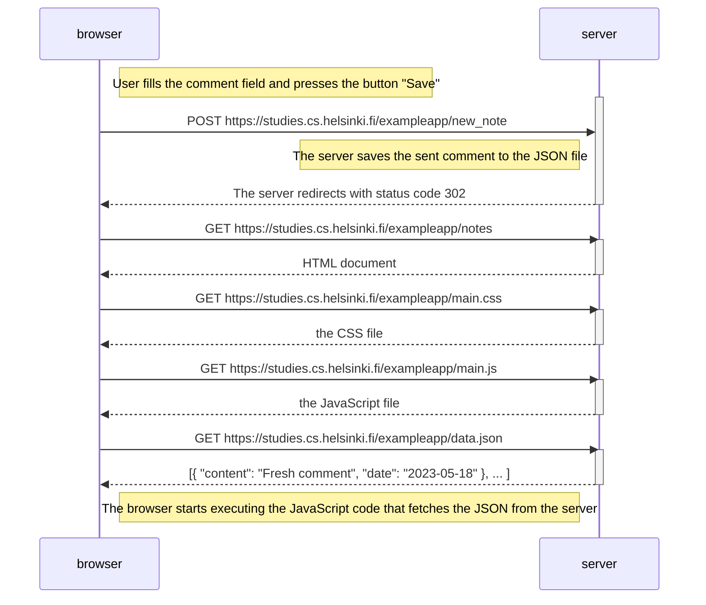
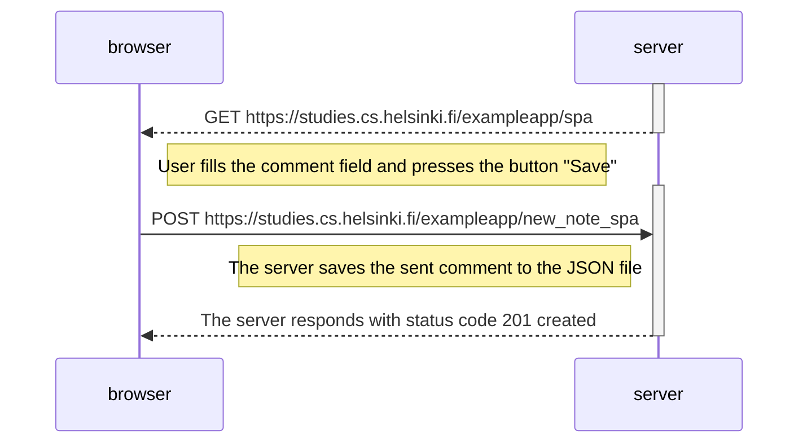

# Assignments

## 0.4 SequenceDiagram

```mermaid
sequenceDiagram
    participant browser
    participant server

    Note right of browser: User fills the comment field and presses the button "Save"
    activate server

    browser->>server: POST https://studies.cs.helsinki.fi/exampleapp/new_note
        Note left of server: The server saves the sent comment to the JSON file
    server-->>browser: The server redirects with status code 302
    deactivate server

    browser->>server: GET https://studies.cs.helsinki.fi/exampleapp/notes
    activate server
    server-->>browser: HTML document
    deactivate server

    browser->>server: GET https://studies.cs.helsinki.fi/exampleapp/main.css
    activate server
    server-->>browser: the CSS file
    deactivate server

    browser->>server: GET https://studies.cs.helsinki.fi/exampleapp/main.js
    activate server
    server-->>browser: the JavaScript file
    deactivate server

    browser->>server: GET https://studies.cs.helsinki.fi/exampleapp/data.json
    activate server
    server-->>browser: [{ "content": "Fresh comment", "date": "2023-05-18" }, ... ]
    deactivate server


    Note right of browser: The browser starts executing the JavaScript code that fetches the JSON from the server
```

## 0.5 SequenceDiagram / SPA

```mermaid
sequenceDiagram
    participant browser
    participant server

    activate server
    server-->>browser: GET https://studies.cs.helsinki.fi/exampleapp/spa
    deactivate server

    Note right of browser: User fills the comment field and presses the button "Save"

    activate server

    browser->>server: POST https://studies.cs.helsinki.fi/exampleapp/new_note_spa
        Note left of server: The server saves the sent comment to the JSON file
    server-->>browser: The server responds with status code 201 created
    deactivate server
```
